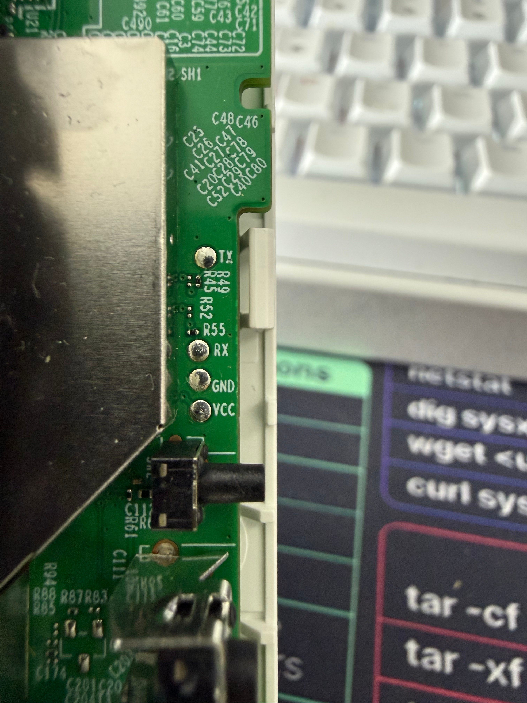

# OpenWrt for the TP-Link RE700X (IPQ5018)

A work-in-progress OpenWrt port for the **TP-Link RE700X** Wi-Fi 6 range
extender (EU v1.0), based on the `qualcommax` target. Built on a full OpenWrt
tree; this README covers only the RE700X-specific port.

> ✅ **Status: working — and the dual-boot brick is FIXED (v1.5).** OpenWrt runs
> great and `sysupgrade` (OpenWrt→OpenWrt) is safe and repeatable. The brick that
> killed a second unit — the forced kernel cmdline (`CONFIG_CMDLINE_FORCE` +
> `ubi.mtd=rootfs`) attaching the **wrong** dual-boot slot when the flasher wrote
> OpenWrt into `rootfs_1` and set `tp_boot_idx=1` — is resolved. OpenWrt now boots
> from **either** slot, validated on hardware from both `rootfs` and `rootfs_1`.
> The *literal* stock→web-GUI reproduction is still pending (the official firmware
> is AES-encrypted and the stock NAND backup was lost), so for a **first** flash
> from stock it remains prudent to have UART + a NAND backup until that final
> end-to-end check is done. This bootloader has **no button/TFTP recovery**. See
> §*The dual-boot brick fix* and §*Install from stock*.

## What works

| Feature | Status |
| --- | --- |
| Boot from NAND (persistent) | ✅ |
| Ethernet (WAN/LAN, RTL8211F) | ✅ |
| 5 front LEDs + 2 buttons | ✅ |
| 2.4 GHz Wi-Fi 6 (IPQ5018) | ✅ |
| 5 GHz Wi-Fi 6 (QCN6122) | ✅ |
| Both radios simultaneously | ✅ (needs the ath11k DP-ring shrink — see *RAM note*) |
| Web-UI-flashable factory image | ✅ brick fixed (v1.5); literal stock→web-GUI re-test pending |

Both radios run simultaneously and stay stable **thanks to the ath11k DP-ring-size
patch** — ~48 MB free on the 256 MB device. Without that patch the oversized RX
rings OOM the box (see *RAM note*).

## RAM note: ath11k DP-ring shrink (both-radio OOM — FIXED)

Both ath11k radios *used to* OOM this 256 MB device (~184 MB usable): the network
stack consumed ~90–110 MB, leaving nothing for userspace → reboot loop. Pinned via
`/proc/allocinfo` (kernel `CONFIG_MEM_ALLOC_PROFILING`); the dominant consumers
were:

- **`__page_frag_cache_refill` ≈ 54 MB and growing** — network-driver RX page
  fragments (nss-dp/EDMA Ethernet + ath11k RX).
- `__dma_direct_alloc_pages` ≈ 19 MB + `atomic_pool_expand` ≈ 16 MB — ath11k /
  coherent DMA.
- `alloc_slab_page` ≈ 20 MB, skb ≈ 5 MB.

These live outside the normal `/proc/meminfo` counters, which is why `free`
showed ~100 MB "missing". It is **not** a userspace/package problem and **not**
fixed by `qcom,ath11k-fw-memory-mode` (mainline ath11k ignores that DT property).

**FIXED** by `patches/ath11k/952-ath11k-reduce-dp-ring-sizes-for-256MB.patch`
(values from openwrt/openwrt#21495 / `CONFIG_ATH11K_SMALLBUFFERS`): it shrinks the
ath11k DP rings (TX-comp 32768→2048, RXDMA-buf 4096→1024, monitor rings
1024/4096/2048→512/128/128). Result: **both radios run with ~48 MB free** on the
256 MB device. 5 GHz is therefore enabled by default again.

## Hardware

- SoC: Qualcomm **IPQ5018** (2.4 GHz built-in) + **QCN6122** (5 GHz)
- RAM: 256 MiB · Flash: 128 MiB SPI-NAND (GigaDevice F50D1G41LB)
- Ethernet PHY: Realtek RTL8211F · 1× Gigabit port
- Power: 100–240 V AC, 50/60 Hz, 0.4 A (internal PSU, wall-plug)
- Bootloader: TP-Link U-Boot 2016.01 (console 115200 8N1, break string `tpl`)

### UART serial console

3.3 V TTL, **115200 8N1**. The unpopulated 4-pad header sits next to the
RF-shield edge; pads top-to-bottom are **TX, RX, GND, VCC** (silkscreen
labelled). Use a 3.3 V adapter and leave VCC disconnected.



## Building

This is a standard OpenWrt build. Select the device and build:

```sh
# in the OpenWrt tree
make menuconfig        # Target: Qualcomm Atheros 802.11ax (qualcommax) >
                       #   Qualcomm IPQ50xx > select "TP-Link RE700X"
make -j"$(nproc)"
```

Output in `bin/targets/qualcommax/ipq50xx/`:

- `…tplink_re700x-squashfs-sysupgrade.bin` — upgrade from a running OpenWrt
- `…tplink_re700x-squashfs-factory.ubi` — raw UBI for initial install
- `…tplink_re700x-initramfs-uImage.itb` — RAM boot via U-Boot/TFTP (for testing)

## Install from stock via web GUI (EXPERIMENTAL — have UART ready)

> ✅ **The brick that hit a second unit is fixed (v1.5)** — see §*The dual-boot
> brick fix*. The cause (the forced kernel cmdline attaching the wrong dual-boot
> slot) is resolved, and OpenWrt now boots from whichever slot the flasher writes
> (validated on hardware from both slots). The *literal* stock→web-GUI install
> hasn't been re-run end-to-end yet (official firmware is AES-encrypted; the stock
> backup was lost), so for the **first** flash on a given unit it's still prudent
> to have UART + a full NAND backup. This bootloader has **no button/TFTP
> recovery**. Recover a mis-set boot slot via UART: `setenv tp_boot_idx 0; saveenv`.

The flow — flash from the **stock** TP-Link web interface:

1. Grab the factory image from the latest [release](../../releases)
   (`re700x-v1.1-factory-webflash.bin`), or build it yourself (below).
2. On the stock RE700X: web UI → **System → Firmware Upgrade**.
3. Upload `re700x-v1.1-factory-webflash.bin` and start the upgrade.
4. The device writes OpenWrt to the inactive dual-boot slot and reboots into it.
   Your stock firmware stays in the other slot as a fallback.

Requirements: the device must be running **stock firmware** with an installed
version ≤ the image's `soft_ver` (the released image is bumped to `9.9.9` so it
always passes the stock anti-downgrade check). Verify the download against
`SHA256SUMS` before flashing.

### Build the factory image yourself

```sh
# in the OpenWrt tree, after a normal build
./re700x-factory-pack.py \
  --os bin/targets/qualcommax/ipq50xx/openwrt-qualcommax-ipq50xx-tplink_re700x-squashfs-factory.ubi \
  --bump-version "9.9.9 Build 20991231 Rel. 99999" \
  -o re700x-factory.bin
```

This wraps the rootfs UBI into the stock `nvrammanager` upload format (TP-Link
safeloader + the reverse-engineered `FwUpTbl` partition table). The format was
reverse-engineered from the stock `nvrammanager` and the whole flash path is
verified on real hardware — details in `RE700X-FACTORY-IMAGE-PROBLEM.md`.

## Alternative: UART / TFTP (recovery or development)

UART header location and pinout: see [§Hardware → UART serial console](#uart-serial-console)
(3.3 V TTL, 115200 8N1; pads TX/RX/GND/VCC).

1. **Back up the stock NAND first** (via U-Boot or a running system). Keep it.
2. Test in RAM via U-Boot/TFTP before touching flash:
   ```
   setenv serverip <host>; setenv ipaddr <dev>
   tftpboot 0x44000000 …-initramfs-uImage.itb
   bootm 0x44000000
   ```
3. From the booted OpenWrt, install with `sysupgrade -n …-sysupgrade.bin`.

The stock U-Boot selects the FIT config by name, so the build sets
`DEVICE_DTS_CONFIG = config@mp02.1`; the UBI partition is `rootfs` (not
`firmware`).

## The dual-boot brick fix (v1.5)

The RE700X has two rootfs slots (`rootfs` = mtd11, `rootfs_1` = mtd12) and the
stock flasher writes OpenWrt into the **inactive** slot, then points U-Boot's
boot-alter (`tp_boot_idx`) at it. The original port force-set the kernel cmdline
(`CONFIG_CMDLINE_FORCE` + `ubi.mtd=rootfs`), so a unit flashed into `rootfs_1`
booted the slot-1 kernel but the kernel still attached **slot 0** → root not
found → brick (no button/TFTP recovery on this bootloader).

The fix is the idiomatic qualcommax approach (no kernel patch needed — the
`bootargs-append` / `bootargs-find/replace` mechanism is already provided by
`patches-6.12/0911-arm64-cmdline-replacement.patch`, and the other ipq5018
boards use it):

1. **`target/linux/qualcommax/config-6.12`** — dropped the RE700X
   `CONFIG_CMDLINE="…" / CONFIG_CMDLINE_FORCE=y` hack, reverting to the generic
   empty cmdline so the kernel honours the bootloader-provided one.
2. **DTS `/chosen`** — replaced the hard `bootargs` with
   `bootargs-append = " root=/dev/ubiblock0_1 coherent_pool=4M"`.

A UART diagnostic (a `CONFIG_CMDLINE_FROM_BOOTLOADER` build) proved the stock
U-Boot already passes a **slot-correct** `ubi.mtd=rootfs` / `ubi.mtd=rootfs_1`
(per `tp_boot_idx`); its only problem was `root=mtd:ubi_rootfs`, which mainline
can't mount. The kernel now inherits that slot-correct `ubi.mtd` and our appended
`root=/dev/ubiblock0_1` wins (Linux uses the last `root=`). Result, verified on
hardware: OpenWrt boots cleanly from **both** slots, both radios up.

**Caveat:** the *literal* stock→web-GUI install was not re-run this round (the
official firmware is AES-encrypted "Cloud" type and the stock NAND backup was
lost). The slot the web-GUI flasher writes is byte-identical to what was tested
(`nvrammanager` does `ubiformat -o 0x1814 -S <field0>` of the same payload + the
same `tp_boot_idx`), so it's logically covered — but a full stock-device web-GUI
flash remains the final confirmation.

## The 5 GHz / QCN6122 fix (for other IPQ5018+QCN6122 ports)

The QCN6122 is not a PCIe card — it boots as a protection domain (userpd2) on
the shared Q6/WCSS, and the firmware resets it via a GPIO named in the PIL
**boot-args**. Two board-specific values, both recovered from the stock
firmware, were needed:

1. `&q6v5_wcss` boot-args `<0x1 4 3 15 0 0  0x2 4 2 0x1b 0 0>` — UPD2 (the
   QCN6122) on **PCIE1 + reset GPIO 27 (0x1b)**, a board override of the
   firmware-default GPIO 18. Without it the userpd stalls in init (DOG
   watchdog / `err_smem_ver`) and crashes the Q6, killing 2.4 GHz too.
2. A QCN6122 `board-2.bin` (`package/firmware/ipq-wifi/src/board-tplink_re700x.qcn6122`)
   built from the stock `bdwlan.b60` board data; otherwise ath11k fails with
   board-data load `-12`.

See `NOTES-re700x.md` for the full bring-up log and `RE700X-CHANGELOG.md` for
versioned images.

## Roadmap

- [x] **Fix the dual-boot brick** (v1.5): the kernel cmdline is now slot-aware —
      it inherits the stock U-Boot's slot-correct `ubi.mtd` and appends `root=`
      via the DTS `/chosen` `bootargs-append`, instead of forcing `ubi.mtd=rootfs`.
      Validated on hardware booting cleanly from both `rootfs` and `rootfs_1`.
- [~] Factory image flashable from the stock TP-Link web UI (no soldering) —
      `re700x-factory-pack.py` works and the brick is fixed; the *literal*
      stock→web-GUI install still needs one final end-to-end re-test (blocked this
      round: official firmware is AES-encrypted, stock NAND backup lost).
- [ ] Fix sysupgrade slot-awareness: `platform.sh` always writes
      `CI_UBIPART=rootfs` (slot 0), ignoring the booted slot.
- [ ] Integrate the `FwUpTbl` format into `tplink-safeloader` so `make` emits a
      ready-to-flash `factory.bin` directly (instead of the separate packer).
- [ ] WPA3 (SAE) defaults.
- [ ] Upstreaming to OpenWrt.

## Credits & safety

Reverse-engineered from a stock NAND dump and the stock firmware. **No
device-specific MACs, PINs, serials, or ART/calibration dumps are published in
this repo.** Use at your own risk; have a UART console and a NAND backup ready.
